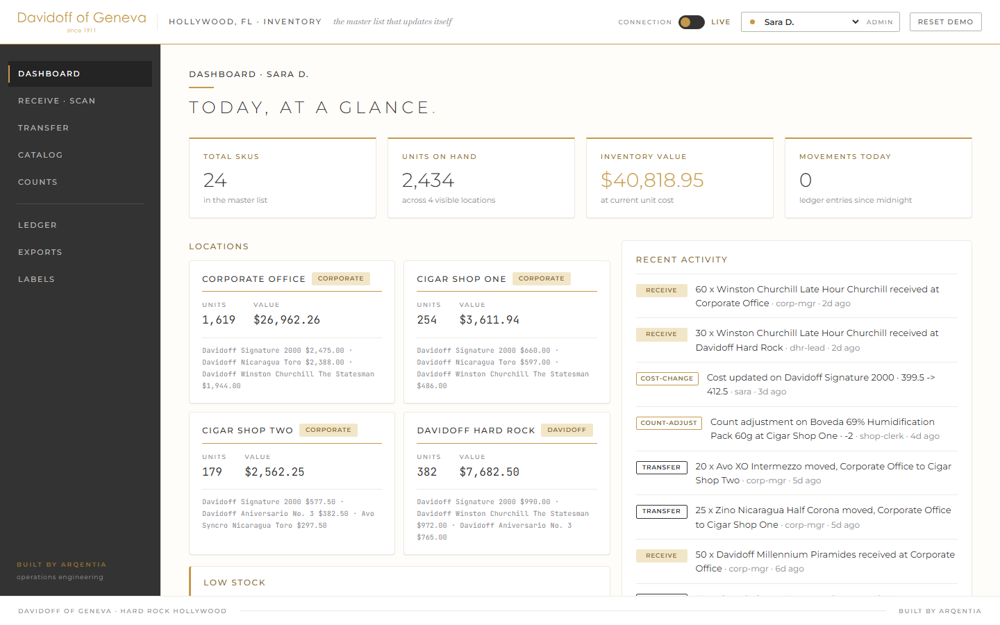
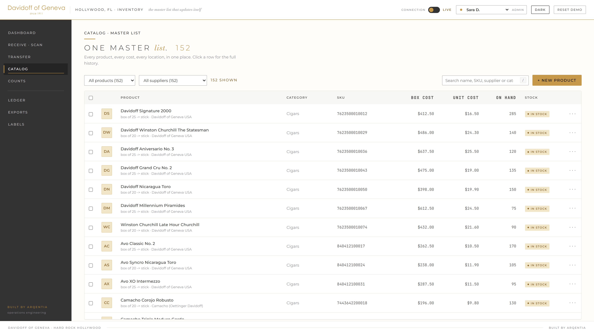

# Barcode inventory system, working demo

A functional demo of a barcode driven inventory system for a four location,
two entity cigar retail operation. It runs entirely in the browser: no
install, no database, no backend.

Built by [Arqentia](https://arqentia.com). Independent vendor prototype,
not affiliated with or endorsed by any brand shown. All product names,
costs and quantities are illustrative demo data.



## Run it

```bash
cd app
node serve.mjs        # http://localhost:4173
```

Opening `app/index.html` directly works too, except the camera scanner
(browsers require localhost or https for camera access). A real USB barcode
scanner in HID mode works anywhere: it types into the focused scan field.

## The 42 second overview

`video/davidoff-inventory-demo-42s.mp4` is a silent capability reel of the
running app. `docs/Demo-Overview.pdf` is a four page brochure explaining the
dashboard and what it changes about the operation.

## What it does

| Screen | What works |
|---|---|
| Dashboard | Live totals, inventory value at current unit cost, per location stock and value, low stock panel, movement activity feed |
| Receive, scan | USB scanner, phone camera, or on screen simulator. Known codes log instantly, unknown codes open a short product form |
| Transfer | Corporate to shop in one movement, both sides see the same ledger entry |
| Catalog | Search, category and supplier filters, column sorting, cost history per product, bulk CSV export |
| Counts | Count sheets per location with expected quantities, variances applied as auditable adjustments |
| Ledger | Full movement history, filterable by location and type |
| Exports | Catalog, ledger, stock by location and valuation, as CSV |
| Labels | Printable sheets with real scannable Code 39 barcodes for products that arrive without one |

Plus, live in the demo:

- **Buy unit is not sell unit.** A box of 25 is bought by the box and sold by
  the stick; the stick cost derives from the box cost automatically.
- **Products with no barcode** get an internal SKU and a printable label, then
  scan like any other item.
- **Access by role and location.** Switch to the shop clerk user and costs for
  the other entity lock.
- **Offline scanning.** Toggle the connection off, keep scanning, reconnect
  and the queue syncs.
- **Light and dark themes**, following the system preference or the in app
  toggle.



## How it is built

Vanilla JavaScript, no framework and no build step.

- `app/store.js` is the whole data layer: catalog, movement ledger, locations
  and entities, cost history, offline queue, CSV export. State persists to
  `localStorage`, so a reload keeps your work and "Reset demo" restores the
  seed. The seed carries about 150 products and a morning's worth of movements,
  and it re-anchors its own timestamps on load, so the demo still opens on a
  live-looking day weeks later rather than on a dashboard full of zeroes.
- `app/app.js` is the UI: one central render driven by store subscriptions,
  hash routing, event delegation.
- `app/vendor/anime.min.js` drives the interaction animations (count ups,
  staggered entrances, hover states, drawer).
- Code 39 barcode rendering is implemented from scratch as inline SVG, so the
  printed labels genuinely scan.

## Note

This is a demo, not the production system. Data is seeded and illustrative.
